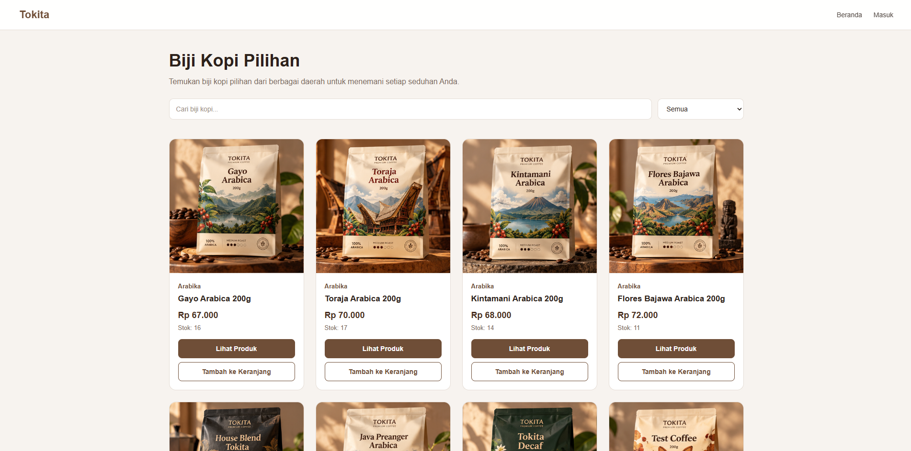
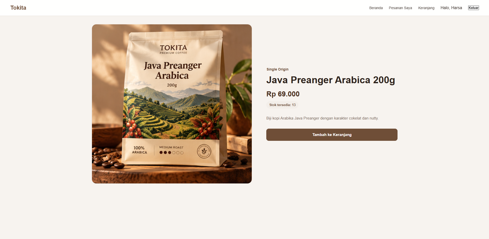
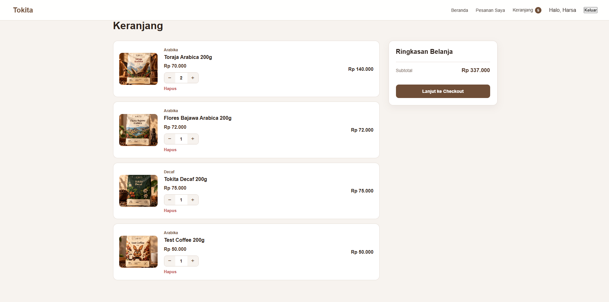
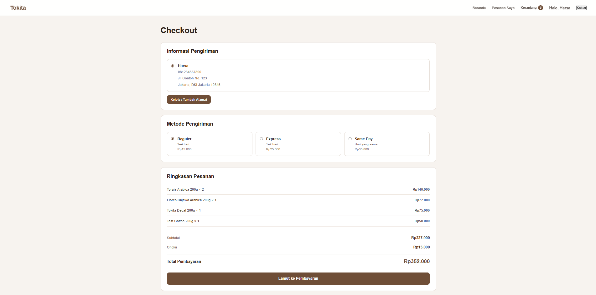
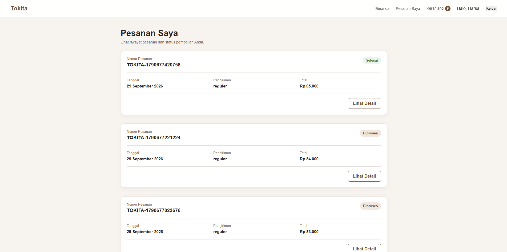
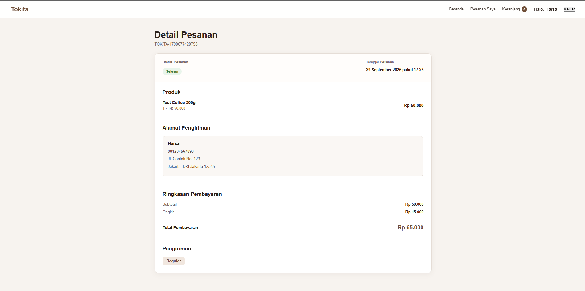
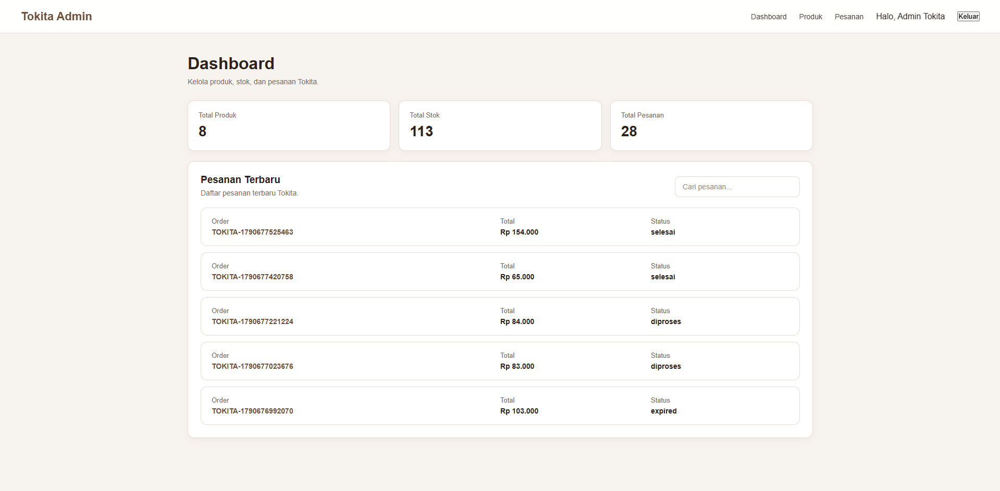
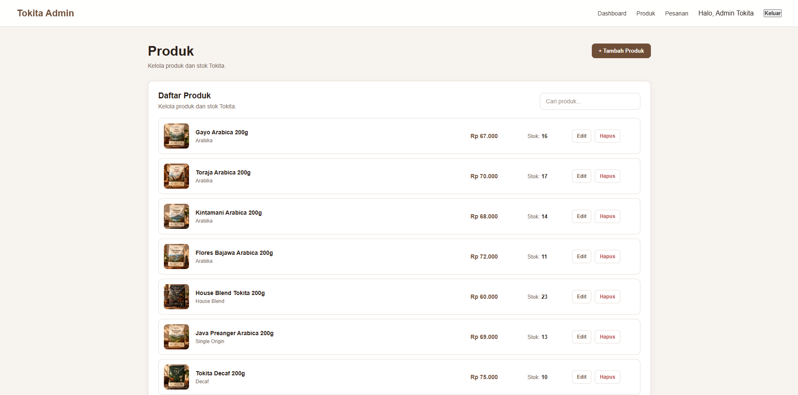
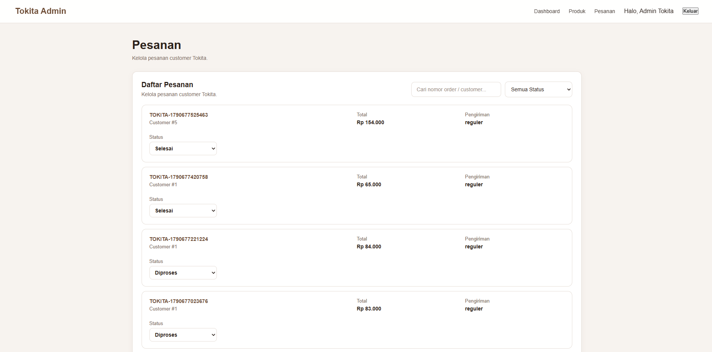

# Tokita — Coffee E-Commerce

Tokita is a web-based coffee e-commerce application designed to provide customers with a complete online shopping experience, from browsing products and managing a shopping cart to checkout, payment, and order tracking. The application also provides an admin interface for managing products and customer orders.

## Features

### Customer

- Customer registration and login
- Product catalog
- Product detail page
- Product search
- Shopping cart management
- Quantity management and stock validation
- Checkout with shipping method
- Midtrans Sandbox payment integration
- Automatic cart clearing after successful payment
- Order history
- Order detail
- Order status tracking

### Admin

- Admin dashboard
- Product management
- Add, edit, and delete products
- Product image upload
- Category management
- Customer order management
- Order status management
- Order monitoring

## Tech Stack

- **React** — Frontend user interface
- **JavaScript** — Main programming language
- **Node.js & Express.js** — Backend and REST API
- **PostgreSQL** — Relational database
- **Midtrans Snap** — Payment gateway integration
- **Multer** — Product image upload
- **Vite** — Frontend development and build tool
- **Git & GitHub** — Version control

## Database

Tokita uses PostgreSQL with the following main tables:

- Customers
- Addresses
- Categories
- Products
- Carts
- Cart Items
- Orders
- Order Details
- Payments

## Project Structure

```text
Tokita/
├── client/
│   ├── public/
│   └── src/
│       ├── assets/
│       ├── components/
│       ├── context/
│       │   └── CartContext.jsx
│       ├── pages/
│       │   ├── AdminProducts.jsx
│       │   ├── Checkout.jsx
│       │   ├── Orders.jsx
│       │   └── PaymentFinish.jsx
│       ├── App.jsx
│       ├── App.css
│       ├── index.css
│       └── main.jsx
│
├── server/
│   ├── uploads/
│   ├── .env
│   ├── package.json
│   └── server.js
│
├── .gitignore
├── package.json
└── README.md
````

## Installation

### 1. Clone the repository

```bash
git clone <YOUR_GITHUB_REPOSITORY_URL>
cd Tokita
```

### 2. Install frontend dependencies

```bash
cd client
npm install
```

### 3. Install backend dependencies

Buka terminal baru:

```bash
cd server
npm install
```

### 4. Configure PostgreSQL

Buat database PostgreSQL untuk Tokita dan sesuaikan konfigurasi database pada backend.

Buat file `.env` di dalam folder `server/`:

```env
PORT=5000

DB_HOST=localhost
DB_PORT=5432
DB_NAME=tokita
DB_USER=postgres
DB_PASSWORD=YOUR_POSTGRES_PASSWORD

MIDTRANS_SERVER_KEY=YOUR_MIDTRANS_SERVER_KEY
MIDTRANS_CLIENT_KEY=YOUR_MIDTRANS_CLIENT_KEY
```

Jangan upload file `.env` ke GitHub.

### 5. Configure Midtrans Sandbox

Gunakan akun Midtrans Sandbox untuk mendapatkan:

* Server Key
* Client Key

Masukkan kedua key tersebut ke dalam:

```text
server/.env
```

Tokita menggunakan Midtrans Sandbox untuk melakukan simulasi pembayaran tanpa menggunakan uang sungguhan.

### 6. Run the backend

Dari folder `server/`:

```bash
node server.js
```

Backend akan berjalan pada:

```text
http://localhost:5000
```

### 7. Run the frontend

Buka terminal baru:

```bash
cd client
npm run dev
```

Kemudian buka URL localhost yang diberikan oleh Vite.

## Demo Account

### Customer

```text
Email: harsa@gmail.com
Password: 123456
Or you can make a new account on register form.
```

### Admin

```text
Email: admin@tokita.com
Password: admin123
```

## Screenshots

### Homepage



### Product Detail



### Shopping Cart



### Checkout



### Payment


### Order History



### Order Detail



### Admin Dashboard



### Product Management



### Order Management



## API

Tokita uses a REST API built with Node.js and Express.js.

### Authentication

* `POST /api/customers/register`
* `POST /api/customers/login`

### Products

* `GET /api/products`
* `POST /api/products`
* `PUT /api/products/:id`
* `DELETE /api/products/:id`

### Cart

* `GET /api/customers/:id/cart/items`
* `POST /api/customers/:id/cart/items`
* `PUT /api/customers/:id/cart/items/:itemId`
* `DELETE /api/customers/:id/cart/items/:itemId`

### Orders

* `POST /api/customers/:id/orders`
* `GET /api/customers/:id/orders`
* `GET /api/customers/:id/orders/:orderId`

### Payment

* `POST /api/orders/:orderId/payment`
* `POST /api/orders/:orderId/payment/snap`
* `GET /api/orders/:orderId/payment`
* `POST /api/payments/webhook`

### Upload

* `POST /api/upload`

### Admin

* `GET /api/admin/dashboard`
* `GET /api/admin/orders`
* `PUT /api/admin/orders/:orderId/status`

## Payment Flow

Tokita uses Midtrans Sandbox for payment testing.

```text
Customer
   ↓
Checkout
   ↓
Create Order
   ↓
Create Midtrans Transaction
   ↓
Midtrans Sandbox
   ↓
Payment
   ↓
Midtrans Webhook
   ↓
Update Payment Status
   ↓
Update Order Status
   ↓
Clear Customer Cart
```

After a successful payment:

* Payment status becomes `paid`
* Order status becomes `diproses`
* Customer cart is cleared

## Order Status

Tokita supports the following order statuses:

* **Menunggu Pembayaran**
* **Diproses**
* **Dikirim**
* **Selesai**
* **Gagal**
* **Expired**

## Security & Environment

Sensitive credentials should not be committed to GitHub.

Make sure `.gitignore` contains:

```text
.env
node_modules/
```

Keep the following values private:

* PostgreSQL password
* Midtrans Server Key
* Other private credentials

## Author

**Harsa Archive**

Full-Stack Developer | PostgreSQL & Database | Web, Mobile & 3D

GitHub: [https://github.com/harsarcv](https://github.com/harsarcv)
